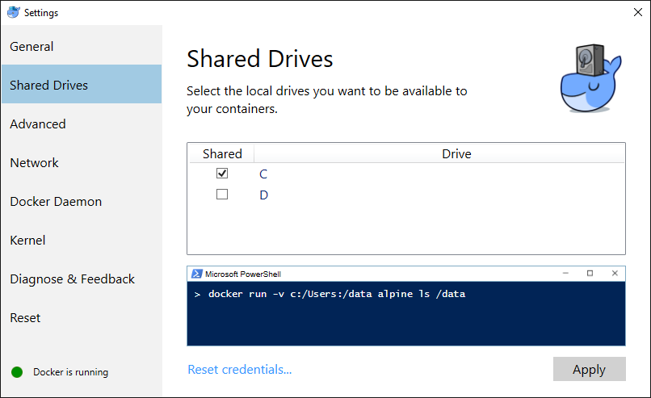

Volumes
=======

This section digs into volumes.  Volumes are durable storage.  Consider it a directory pulled out of the container, stored on the host, and sym-linked in on startup.

Setup
-----

1. Clone this repository.

2. Open a terminal in this `04-Volumes-as-durable-storage/start` directory.

3. Build the container: `docker build -t volumetest:0.1 .`

The problem
-----------

1. Launch the container: `docker run -p 3000:3000 -d volumetest:0.1`

2. Did you get a port in use error?  Run `docker container list` and stop any other containers running on this port.

3. Browse to [http://localhost:3000/](http://localhost:3000/) and upload a file.

4. Click on [See files](http://localhost:3000/files) and see the file you uploaded.

5. Stop the container with `docker container list` and `docker container stop ...` substituting the container name or id for `...`.

6. Remove the container with `docker container rm ...` substituting the container name or id for `...`.

7. Start the container again: `docker run -p 3000:3000 -d volumetest:0.1`

8. Click on [See files](http://localhost:3000/files).

The thin read/write container from the first run is now gone and a new read/write layer was created.  The uploaded data is gone.

In most circumstances this is what we want -- we want isolated runtime environments where nothing changes and we can easily kill it off and start another.  In this case, we want a durable data store.  Let's experiment with volumes.

9. Stop the docker container.  As we build the solution, we'll launch the new image on port 3000, and we want to avoid a port conflict.

The solution
------------

1. Open Docker settings (Click on the whale by the clock), choose Settings, go to Shared Drives, and turn on sharing for the drive / folder your code is in.  This shares your host drive with the Docker Desktop VM.  On Linux, there is no Docker VM, and on Mac, `/Users` may already be shared.

   NOTE: You may need to configure your firewall to allow this SMB share from the Docker Desktop VM into your computer.

2. Modify `Dockerfile`

3. Add this line: `VOLUME ["/app/public"]` just under the `EXPOSE` line.  (Technically it can be anywhere.)

4. Rebuild the container: `docker build -t volumetest:0.2 .`.  Note that it didn't re-run `npm init`.  Caching!

5. Create an empty folder to use as an upload location

6. Run the new image: `docker run -p 3000:3000 -v /path/to/empty/folder:/app/public -d volumetest:0.2` swapping out your folder path -- case sensitive.  If your folder path has spaces in it, you'll need quotes around this.  For Windows, you can use 1 forward or 2 back slashes such as `... -v c:/temp:/app/public ...`.

7. Upload a file on [http://localhost:3000/](http://localhost:3000/), and click [See files](http://localhost:3000/files) and see the file you uploaded.

8. Note the file is now in the empty folder.

9. Stop the container, and start it again.

10. Click on [See files](http://localhost:3000/files) and see the file(s) uploaded previously.

Note: if you leave off the public side of the volume switch (the `/path/on/host:` part), Docker will manage the volume for you, storing it in the Docker Desktop VM.
